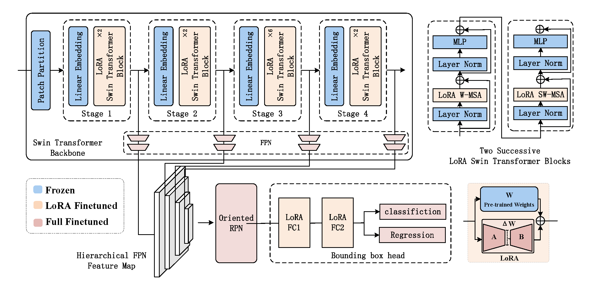
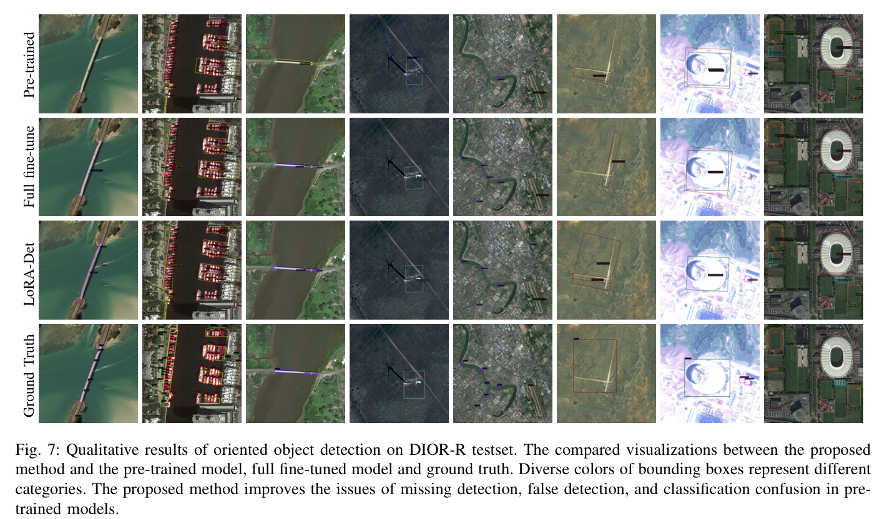

## Low-Rank Adaption on Transformer-based Oriented Object Detector for Satellite Onboard Processing of Remote Sensing Images

Xinyang Pu, Feng Xu

The Key Laboratory of Information Science of Electromagnetic Waves, Fudan University, Shanghai, China

<div align=center>

</div>
<div align=center>

</div>

## Installation
This code was implemented with Python 3.8, PyTorch 1.13.0 and mmrotate. 
You can install all the requirements via the installation instruction of [MMRotate](https://github.com/open-mmlab/mmrotate).

MMRotate depends on [PyTorch](https://pytorch.org/), [MMCV](https://github.com/open-mmlab/mmcv) and [MMDetection](https://github.com/open-mmlab/mmdetection).
Below are quick steps for installation.
Please refer to [Install Guide](https://mmrotate.readthedocs.io/en/latest/install.html) for more detailed instruction.

```shell
conda create -n open-mmlab python=3.7 pytorch==1.7.0 cudatoolkit=10.1 torchvision -c pytorch -y
conda activate open-mmlab
pip install openmim
mim install mmcv-full
mim install mmdet
git clone https://github.com/open-mmlab/mmrotate.git
cd mmrotate
pip install -r requirements/build.txt
pip install -v -e .
```

## Train
```bash
export PYTHONPATH=./

./tools/dist_train.sh configs/lora_oriented_rcnn/lora_backbone_roihead_oriented_rcnn_swin_tiny_fpn_1x_dota_val_test_classwise_fpn_rpn_ft.py 2

./tools/dist_train.sh configs/lora_oriented_rcnn/lora_backbone_roihead_oriented_rcnn_swin_tiny_fpn_1x_dior_val_test_classwise_fpn_rpn_ft.py 2 

./tools/dist_train.sh  configs/lora_oriented_rcnn/lora_backbone_roihead_oriented_rcnn_swin_tiny_fpn_3x_hrsc_val_test_classwise_fpn_ft.py 2
```

## Test

DOTAv1.0 dataset online evaluation:
```bash
python ./tools/test.py  \
  configs/lora_oriented_rcnn/lora_backbone_roihead_oriented_rcnn_swin_tiny_fpn_1x_dota_val_test_classwise_fpn_rpn_ft.py \
  checkpoints/SOME_CHECKPOINT.pth --format-only \
  --eval-options submission_dir=work_dirs/Task1_results

```

DIOR-R dataset evaluation:
```bash
python ./tools/test.py  \
  configs/lora_oriented_rcnn/lora_backbone_roihead_oriented_rcnn_swin_tiny_fpn_1x_dior_val_test_classwise_fpn_rpn_ft.py \
  checkpoints/SOME_CHECKPOINT.pth --eval mAP

```

HRSC2016 dataset evaluation:
```bash
python ./tools/test.py  \
  configs/lora_oriented_rcnn/lora_backbone_roihead_oriented_rcnn_swin_tiny_fpn_3x_hrsc_val_test_classwise_fpn_ft.py \
  checkpoints/SOME_CHECKPOINT.pth --eval mAP

```


## Citation

If you find our work useful in your research, please consider citing:

```
@misc{pu2024lowrank,
      title={Low-Rank Adaption on Transformer-based Oriented Object Detector for Satellite Onboard Processing of Remote Sensing Images}, 
      author={Xinyang Pu and Feng Xu},
      year={2024},
      eprint={2406.02385},
      archivePrefix={arXiv},
      primaryClass={cs.CV}
}
```

